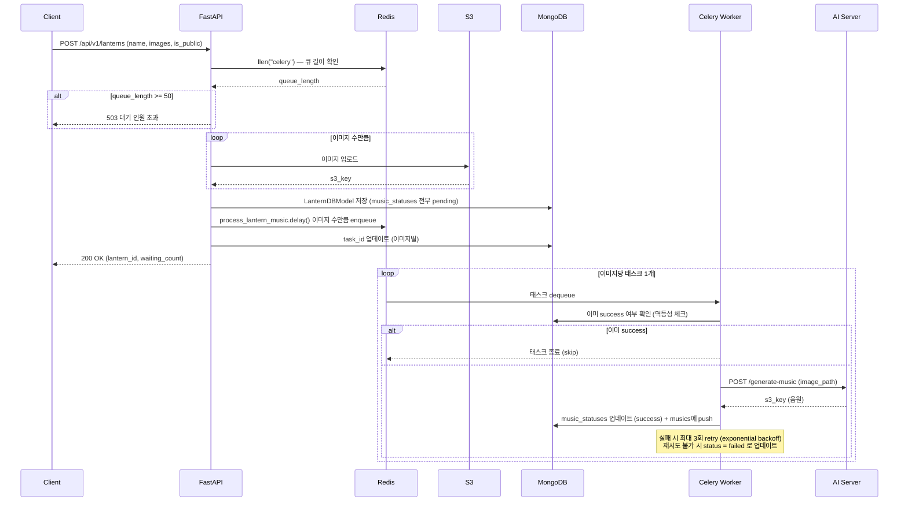
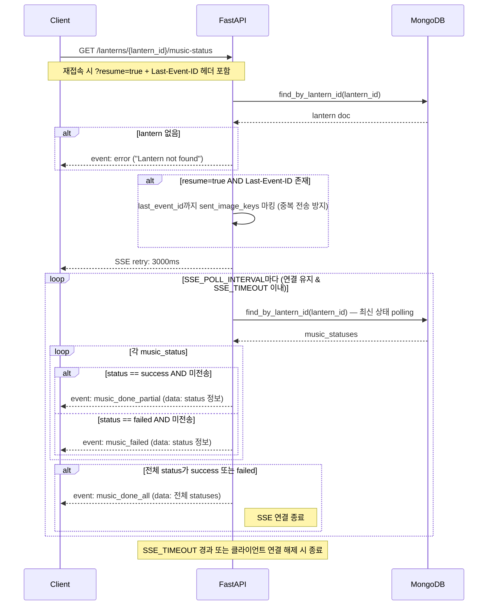

## 기억의 차원

`#이미지 기반 AI 배경음 생성` `#인터랙티브 전시 경험` <br /> <br />
사용자가 이미지를 3장 업로드하면, 이미지 기반 감정 분석을 통해 AI 배경음을 생성하고 이미지와 배경음으로 인터랙티브 전시를 즐길 수 있는 서비스입니다. 추억하고 싶은 순간을 단순히 보는 것이 아니라, 소리와 인터랙션을 함께 활용하여 실제로 느낄 수 있도록 만들고자 했습니다.

> 2025 캡스톤디자인 졸업 프로젝트 <br />
> 개발 기간: 2025.03 ~ 2025.10

 <br />
[Go to YouTube Link](https://www.youtube.com/watch?v=WWsEPMtPJT4)

<br />

## Backend Focus

백엔드에서는 AI 기반 배경음 생성이 핵심 기능이었기 때문에,
다수의 AI 모델들을 안정적으로 서빙하는 구조 설계에 집중했습니다.

- 장시간 AI inference 처리
- 다중 AI 모델 운영
- 실시간 진행 상태 전달
- Worker 장애 대응
- 제한된 GPU 환경 최적화

<br />

### Technical Challenges

#### 1. Celery Worker 장애 대응

- `acks_late=True` 설정으로 task 실행 완료 후 ACK 처리 → 워커 장애 시 task 유실 방지
- 재시도 전 MongoDB에서 해당 이미지가 이미 `success` 상태인지 확인(멱등성 체크) → 중복 AI 호출 방지
- 최대 3회 exponential backoff retry

→ 자세한 분석은 [Blog](https://pyounani.tistory.com/35) 참고
<br />
<br />

#### 2. GPU 메모리 병목 해결

- VRAM 8GB 환경에서 다중 AI 모델 서빙 시 발생하는 메모리 병목 문제를 분석하고, 입력 기반 모델 동적 로딩 구조를 통해 GPU 사용량을 안정화했습니다.

→ 자세한 분석은 [Blog](https://pyounani.tistory.com/37) 참고
<br />

<br />

<br />

## 요청 흐름

1. `POST /api/v1/lanterns` — 입력 검증 → Redis 큐 길이 확인 (최대 50) → 이미지 S3 업로드 → MongoDB에 `LanternDBModel` 저장 → 이미지당 `process_lantern_music` Celery 태스크 1개 enqueue
2. **Celery 워커** — `AI_SERVER_URL` 호출 → 결과 음원을 S3에 저장 → MongoDB `music_statuses` 업데이트 → Redis 채널 `lantern_music:{lantern_id}`에 결과 publish
3. `GET /api/v1/lanterns/{lantern_id}/music-status` — SSE 엔드포인트; `lantern_music:{lantern_id}` 채널을 구독하여 음악 3트랙 완료 또는 `SSE_TIMEOUT` 경과 시까지 이벤트 스트리밍. `last-event-id` + `?resume=true`로 재연결 지원

## 비동기 음악 생성 흐름



## SSE 스트리밍 흐름



## 주요 도메인 모델

**`LanternDBModel`** — MongoDB `lantern` 컬렉션의 단일 문서

| 필드             | 타입                    | 설명                                          |
| ---------------- | ----------------------- | --------------------------------------------- |
| `lantern_id`     | `str`                   | 고유 식별자 (`{이름}-{4자리}`) — unique index |
| `user_name`      | `str`                   | 사용자 이름                                   |
| `images`         | `list[ImageInfo]`       | 업로드된 이미지 정보 목록                     |
| `music_statuses` | `list[MusicStatusInfo]` | 각 음악 상태 (`pending \| success \| failed`) |
| `musics`         | `list[MusicInfo]`       | S3 키 + 생성 타임스탬프 목록                  |
| `is_public`      | `bool`                  | 공개 여부                                     |
| `created_at`     | `datetime`              | 생성 시각                                     |

## Lantern ID 형식

`{이름}-{4자리 숫자}` 형식 (예: `홍길동-4237`)

허용 정규식: `^[가-힣a-zA-Z0-9]+-[0-9]{4}$`

## 설치 및 실행

**의존성 설치**

```bash
uv sync
```

**로컬 실행 (`.env` 필요)**

```bash
uv run uvicorn app.main:app --host 0.0.0.0 --port 8000 --loop asyncio
```

**풀스택 실행 (Redis + MongoDB + API + Celery 워커)**

```bash
docker-compose up --build
```

**Celery 워커 단독 실행**

```bash
celery -A app.core.tasks.celery_app.celery_app worker --loglevel=info --concurrency=1 --pool=prefork --prefetch-multiplier=1 -Q celery
```

## 린트 / 테스트

```bash
uv run black app/
uv run isort app/
uv run mypy app/
uv run pytest
```

## 환경 변수 (`.env`)

### 필수

| 변수                    | 설명                            |
| ----------------------- | ------------------------------- |
| `MONGO_URI`             | MongoDB 연결 URI                |
| `MONGO_DB`              | 사용할 DB 이름                  |
| `MONGO_INITDB_DATABASE` | 초기화 DB 이름                  |
| `REDIS_URL`             | Redis 연결 URL                  |
| `AWS_ACCESS_KEY_ID`     | AWS 액세스 키                   |
| `AWS_SECRET_ACCESS_KEY` | AWS 시크릿 키                   |
| `AWS_REGION`            | AWS 리전                        |
| `AWS_S3_BUCKET_NAME`    | S3 버킷 이름                    |
| `AI_SERVER_URL`         | AI 음악 생성 서버 URL           |
| `API_PREFIX`            | API 경로 prefix (예: `/api/v1`) |

### 선택

| 변수                  | 기본값                  | 설명                                               |
| --------------------- | ----------------------- | -------------------------------------------------- |
| `APP_ENV`             | `production`            | `development` 설정 시 오류 응답에 디버그 정보 포함 |
| `CORS_ORIGINS`        | `http://localhost:5173` | 허용할 CORS origin (콤마 구분)                     |
| `SSE_TIMEOUT`         | `180`                   | SSE 연결 유지 시간 (초)                            |
| `DISCORD_WEBHOOK_URL` | —                       | 오류 알림용 Discord 웹훅 URL                       |
| `BACKEND_PORT`        | `8000`                  | Docker 포트                                        |
